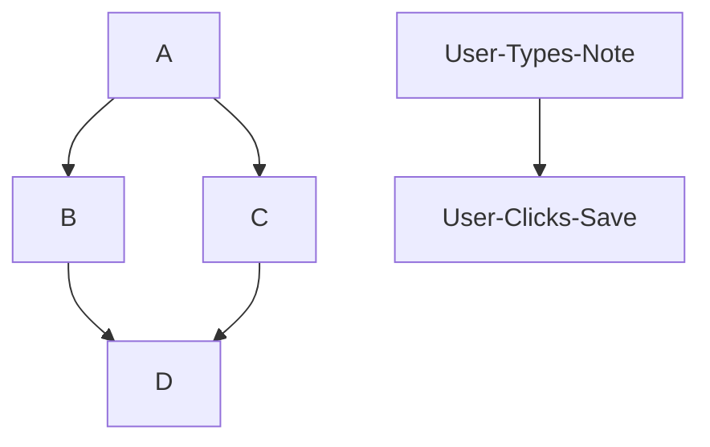

Here is a simple flow chart:



0.4 User Creates a New Note:

On the browser:
```mermaid graph TD;
    
```

browser->server: HTTP POST https://fullstack-exampleapp.herokuapp.com/new_note \n form-data: "note"
server-->browser: Redriect: /notes
browser->server: HTTP GET https://fullstack-exampleapp.herokuapp.com/notes
server-->browser: notes HTML
browser->server: HTTP GET https://fullstack-exampleapp.herokuapp.com/main.css
server-->browser: main.css
browser->server: HTTP GET https://fullstack-exampleapp.herokuapp.com/main.js
server-->browser: main.js

note over browser:
main.js requests data.json
end note

browser->server: HTTP GET https://fullstack-exampleapp.herokuapp.com/data.json
server-->browser: data.json \n [content: "foo" date: "bar"]

note over browser:
event handler renders notes
end note